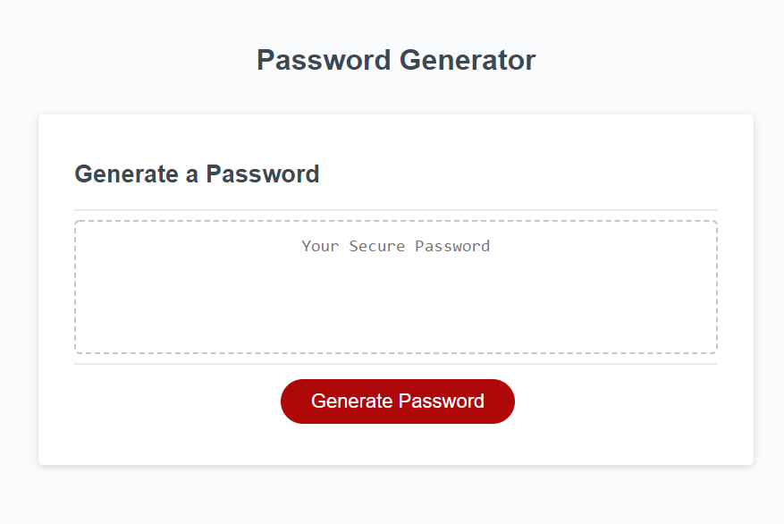

# Password_Generator
This code was created in JavaScript to produce a random password after answering a series of questions. The password need to be a minimum of 8 characters and a maximum of 128. Characters that could be included were the following: UPPERCASE,lowercase, numerical values (0,1,2,3,4,5,6,7,8,9) and special characters(!@#$%^&*).

